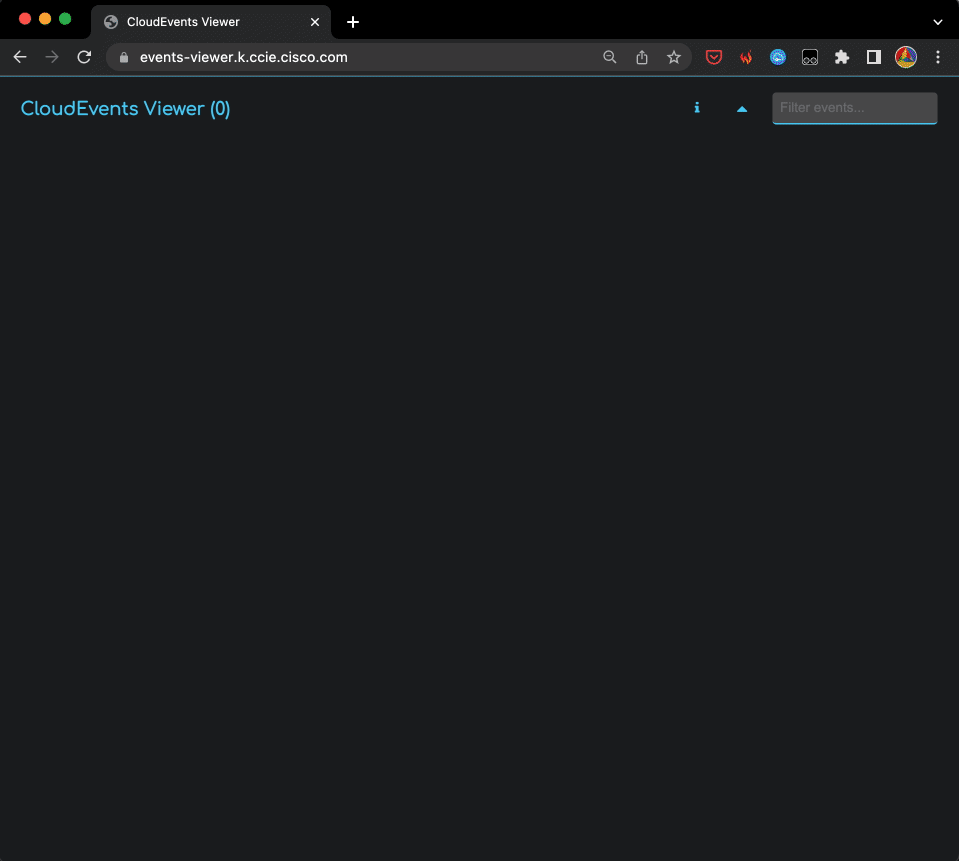

# CloudEvent Viewer

This micro-app can be used as a test subscriber of [CloudEvents](https://cloudevents.io/).

It provides a web-based interface to quickly visualize events that it received on its `POST /events/pub` endpoint.



## Limitations

There is NO PERSISTANCE anywhere so refreshing the page on the browser will reset the state.  

> **It does NOT currently support concurrent users or multiple browsers, as it is intended to be used locally!**

It is deployed at https://events-viewer.k.ccie.cisco.com **for illustration only**!

## Frontend

The root URL shows a simple HTML page that automatically refreshes as new CloudEvents are received by the backend.

- The UI stacks the events so that the most recent one is on top.
- User can search for any String anywhere in any events with the filter input box and the UI will show/hide events accordingly.
- User can toggle the display of the event details by clicking the any event header.
- There is a ToggleAll button next to the filter that will toggle the expand/collapse status of all events.

## CloudEvents

The app provides an endpoint at `/events/pub` that accepts HTTP POST requests with CloudEvents payloads.

- The payload must have the `Content-Type` header set to `application/cloudevents+json`.
- The event must be formatted as per the CloudEvents [Specifications v1.0.2](https://github.com/cloudevents/spec/blob/v1.0.2/cloudevents/spec.md) in [JSON Format](https://github.com/cloudevents/spec/blob/v1.0.2/cloudevents/formats/json-format.md).  

When an event is received, it is added to a queue that is consumed by a background task that logs the events to a server-sent events (SSE) stream.

## Streaming

The SSE stream can be accessed at `/stream` using a browser or any SSE client. The stream sends a JSON payload for each received event, with the event payload and a timestamp indicating when the event was received.


## Local Usage

1. Pull and run the Docker image:

`docker run --name cloudevent-viewer -p 8888:80 ccie-gitlab.ccie.cisco.com:4567/mozart/infrastructure/eventing/cloudevent-viewer:0.1.0`

2. Browse to http://localhost:8888

3. Emit Cloudevent to http://localhost:8888/events/pub

4. Enjoy!

## Development

`Hint`:

The debugger fails with vscode v1.75 (currently the latest version).
Have to downgrade to 1.74: https://code.visualstudio.com/updates/v1_74 Then, disable automatic updates (settings > 'update': set to "none")


```sh
TAG="0.1.0"

docker build -t cloudevent-viewer:latest .

docker tag cloudevent-viewer:latest cloudevent-viewer:$TAG
docker tag cloudevent-viewer:latest ccie-gitlab.ccie.cisco.com:4567/mozart/infrastructure/eventing/cloudevent-viewer:$TAG

docker run --name cloudevent-viewer -p 8888:80 cloudevent-viewer:0.1.0

docker login ccie-gitlab.ccie.cisco.com:4567

docker push ccie-gitlab.ccie.cisco.com:4567/mozart/infrastructure/eventing/cloudevent-viewer:$TAG

```
