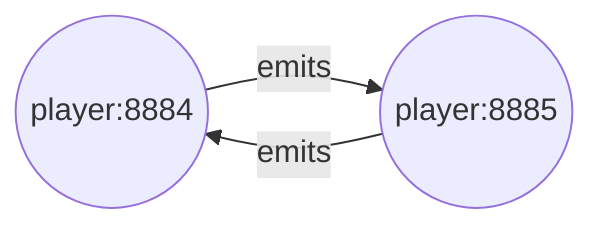

# CloudEvent Player

This micro-app can be used as a test **subscriber** and/or test **emitter** of [CloudEvents](https://cloudevents.io/).

It is very useful in an event-driven architecture to monitor events and test subscriptions in real-time with a unified dashboard interface.

📚 **Full Documentation**: <https://bvandewe.github.io/events-player/>

## Quick Start

**Zero configuration required** - just run and go:

```bash
docker run -p 8884:8080 ghcr.io/bvandewe/events-player:latest
```

Then open: <http://localhost:8884>

## Getting Started

Run two instances locally and send events between them:


```mermaid
flowchart LR
    A((player:8884)) -->|emits|B((player:8885))
    B -->|emits|A
```

```bash
# Instance 1: http://localhost:8884
docker run -d --rm -p 8884:8080 \
  -e api_default_generator_gateways='{"urls": ["http://localhost:8884/events/pub", "http://host.docker.internal:8885/events/pub"]}' \
  ghcr.io/bvandewe/events-player:latest

# Instance 2: http://localhost:8885
docker run -d --rm -p 8885:8080 \
  -e api_default_generator_gateways='{"urls": ["http://localhost:8885/events/pub", "http://host.docker.internal:8884/events/pub"]}' \
  ghcr.io/bvandewe/events-player:latest
```


The app provides a web-based interface that enables users to visualize events as they are received on the `POST /events/pub` endpoint. The UI provides simple web-form that enables users to generate event(s) and emit/transmit them to a selected customizable event gateway.

It can very easily be deployed locally (included in a `docker-compose` file) or remotely (in Kubernetes or Docker) and may be configured as a subscriber to an event channel (like [Cloud Streams](https://github.com/neuroglia-io/cloud-streams)).

## Features

- 🎯 **Event Generation**: Generate CloudEvents with customizable properties and batch support
- 📡 **Real-Time Monitoring**: Server-Sent Events (SSE) streaming with unified dashboard
- 🔍 **Event Inspection**: Examine CloudEvent structure with syntax-highlighted JSON
- 📊 **Unified Dashboard**: Single-page view with Streams, Timeline, Metrics, and Analytics
- 🔄 **Pub/Sub Support**: Acts as both publisher and subscriber
- � **Deep Search**: Search anywhere in event payloads with persistence
- 📈 **Timeline Visualization**: Chart.js timeline with configurable time buckets (1s to 1hr)
- 🎨 **Interactive Charts**: Click-to-filter on sources, types, and subjects
- 🔐 **Authentication & Authorization**: OAuth 2.0/OIDC with RBAC - **optional, disabled by default**
- 💾 **Two-tier Storage**: IndexedDB with separate tiers for full events and metadata
- 🆔 **Request Tracing**: Built-in Request ID tracing for debugging
- 🏥 **Health Monitoring**: Health check endpoint for monitoring systems

## Unified Dashboard

CloudEvent Player v0.4.0 features a redesigned unified dashboard:

- **Single-page View**: No more switching between pages
- **Real-time Metrics**: Total events, avg rate, top types/sources
- **Tabs**: Streams (event list) and Timeline (visual chart)
- **Global Filters**: Type, Source, Subject, Time Range affect all views
- **Search**: Find events by any text in payload
- **Analytics**: Top sources, types, subjects with click-to-filter
- **Storage Indicators**: Visualize IndexedDB usage (Tier 1 + Tier 2)

## Authentication

**Authentication is disabled by default.** The application works out of the box without any authentication configuration.

To enable authentication and authorization, set the `api_auth_required` environment variable to `"true"`:

```bash
docker run -p 8884:8080 -e api_auth_required="true" ghcr.io/bvandewe/events-player:latest
```

When `api_auth_required=false` (default):

- All features accessible without login
- No authentication tokens required
- Admin features (Clear Storage, Current Clients, Manage Tasks) available via gear icon

When `api_auth_required=true`:

- OAuth 2.0/OIDC authentication enforced
- Role-based access control (admin, operator, user)
- Login required for event generation and admin features

See the [full authentication documentation](https://bvandewe.github.io/events-player/authentication/) for OAuth/OIDC configuration details.

## Limitations

- **No Server-Side Persistence**: Refreshing the browser resets client-side state
- **Client-Side Storage Only**: Events stored in browser IndexedDB (capacity-based FIFO queues)
  - Tier 1: Full events (default: 5000 max)
  - Tier 2: Metadata (default: 100,000 max)
- **Display Limit**: Configurable max events rendered in DOM (default: 1000)

## Usage

The root URL shows the **Unified Dashboard** with:

- **Metrics Row**: Real-time event counters and rate statistics
- **Streams/Timeline Tabs**: Switch between event list and visual timeline
- **Search Box**: Filter events by any text in payload (persisted)
- **Analytics Charts**: Top sources, types, subjects (click to filter)
- **Storage Indicators**: IndexedDB usage visualization

### Event Stream

The backend validates and handles CloudEvents via the `POST /events/pub` endpoint and streams events to all connected clients via [SSE](https://developer.mozilla.org/en-US/docs/Web/API/Server-sent_events).

- Payload must have `Content-Type: application/cloudevents+json`
- Event must follow CloudEvents [Specifications v1.0.2](https://github.com/cloudevents/spec/blob/v1.0.2/cloudevents/spec.md) in [JSON Format](https://github.com/cloudevents/spec/blob/v1.0.2/cloudevents/formats/json-format.md)

When a valid event is received, it's pushed to all connected clients and stored in IndexedDB.

## Local Usage

1. Pull and run the Docker image:

   ```bash
   docker run --rm -p 8884:8080 ghcr.io/bvandewe/events-player:latest
   ```

2. Browse to <http://localhost:8884>

3. Emit CloudEvent to <http://localhost:8884/events/pub>

4. Enjoy!

## SSE Stream Access

The SSE stream can be accessed at `/stream/events` using a browser or any SSE client:

```bash
curl -N http://localhost:8884/stream/events
```

The stream sends JSON payloads for each received event.

## Development

### OAuth/Keycloak Setup

When running the development environment with `docker-compose -f docker-compose.debug.yml up -d`, Keycloak is available at:

- **URL**: <http://localhost:8090>
- **Admin Username**: `admin`
- **Admin Password**: `admin`

The master realm is automatically configured to allow HTTP access (development only). See `deployments/keycloak/HTTP_CONFIGURATION.md` for details.

⚠️ **Security Note**: The HTTP configuration is for development only and should NEVER be used in production!

### API Documentation & Authentication

The API documentation is available via Swagger UI at `/api/docs`. When Keycloak is configured, Swagger UI includes an "Authorize" button that allows you to authenticate and test protected endpoints.

**To authenticate in Swagger UI:**

1. Navigate to <http://localhost:8080/api/docs> (or your deployment URL + `/api/docs`)
2. Click the **"Authorize"** button in the top-right corner
3. Select the scopes you want (typically `openid`, `profile`, `email`)
4. Click **"Authorize"** to start the OAuth2 Authorization Code flow
5. Log in with your Keycloak credentials
6. You'll be redirected back to Swagger UI with an active session

Once authenticated, you can test protected endpoints directly from Swagger UI. The authentication token will be automatically included in all API requests.

**Available Security Schemes:**

- **OAuth2AuthorizationCode**: Full OAuth2 authorization code flow with PKCE (recommended for browser use)
- **BearerAuth**: Direct JWT bearer token (for API clients that already have a token)

### VS Code Debugging

`Hint`:

The debugger fails with vscode v1.75 (currently the latest version).
Have to downgrade to 1.74: <https://code.visualstudio.com/updates/v1_74> Then, disable automatic updates (settings > 'update': set to "none")
