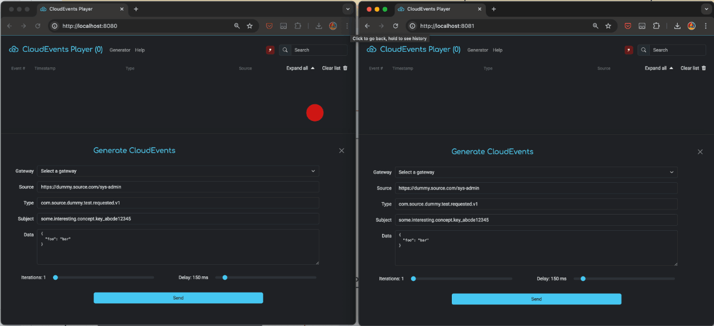
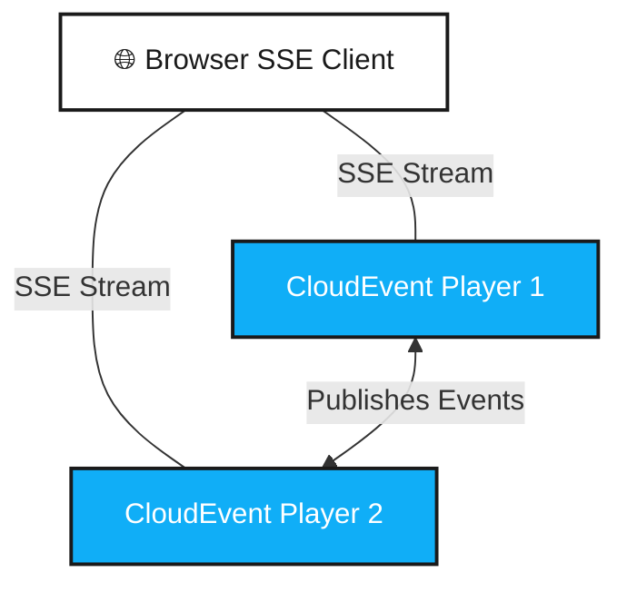
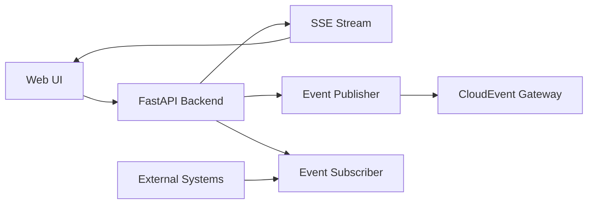

# CloudEvent Player

**A developer tool for testing and debugging CloudEvents in distributed systems.**

<div style="text-align: center; margin: 30px 0;">
  
</div>

## What is CloudEvent Player?

CloudEvent Player is a lightweight, browser-based tool designed to help developers test, generate, and monitor [CloudEvents](https://cloudevents.io/) in real-time. It combines an event publisher, subscriber, and visual inspector in a single application.

<div style="text-align: center; margin: 30px 0;">
  
</div>

**Demo Setup:** Two CloudEvent Players monitoring each other's events



## Key Features

### 🎯 **Event Generation**

Generate CloudEvents with customizable properties, data payloads, and delivery options. Perfect for testing event-driven architectures without writing code.

- **Built-in Generator UI**: Side panel with form for quick event creation
- **Batch Generation**: Generate multiple events with configurable delays
- **Background Tasks**: Long-running event generation managed by admin controls
- **Custom Gateways**: Send events to any HTTP endpoint
- **Form Persistence**: Generator settings saved automatically

### 📡 **Real-Time Monitoring**

Watch events flow through your system with Server-Sent Events (SSE) streaming. See events as they arrive with syntax-highlighted JSON in a **unified dashboard**:

- **Unified Dashboard**: Single-page view combining all features

    - **Streams Tab**: Real-time event list with accordion expansion
    - **Timeline Tab**: Visual Chart.js timeline showing event activity over time
    - **Search**: Filter events by any text in payload (with persistence)
    - **Real-time Metrics**: Total events, avg rate, top types/sources
    - **Analytics Charts**: Top sources, types, subjects (click to filter)
    - **Storage Indicators**: Two-tier IndexedDB usage visualization

- **Synchronized Filtering**: Global filters affect streams, timeline, metrics, and charts
- **Click-to-Filter**: Click any source/type/subject in charts to filter all views
- **Time-based Buckets**: Configurable timeline granularity (1 sec to 1 hr)

### 🔍 **Event Inspection**

Examine CloudEvent structure, validate schemas, and debug data payloads with an intuitive web interface:

- **Expandable Event Cards**: Click to view full JSON structure
- **Syntax Highlighting**: Easy-to-read JSON with proper formatting
- **Deep Search**: Search anywhere in event payload (CloudEvent attributes + data)
- **Advanced Filtering**: Filter by type, source, subject, and time range
- **Real-time Counter**: Shows filtered vs total events
- **Persistent Search**: Search term survives page reloads

### 🔄 **Pub/Sub Support**

Acts as both publisher and subscriber, allowing you to test complete event workflows.

### 🔐 **Authentication & Authorization**

**Authentication is disabled by default** - the application works out of the box without any setup.

Enable optional OAuth 2.0/OIDC authentication with role-based access control (RBAC) by setting `auth_required=true`:

- **Admin, Operator, and User roles** with fine-grained permissions
- **Automatic token refresh** with OIDC offline_access for uninterrupted sessions
- **Authorization Manager** for custom operator permissions
- **Istio integration** for header-based authentication

When authentication is disabled (`auth_required=false`, default):

- All features are immediately accessible
- No login or configuration required
- Admin features available via gear icon in navigation

See the [Authentication Guide](authentication.md) for OAuth/OIDC setup details and the [RBAC Configuration Guide](rbac-guide.md) for a complete step-by-step setup with Keycloak.

### 💾 **Client-Side Storage**

Two-tier browser storage architecture for offline capability:

- **IndexedDB**: Persistent storage for event history (survives browser restarts)
- **In-Memory Cache**: Fast access for current session
- **Storage Management**: Clear storage from UI with admin controls

### 👨‍💼 **Admin Features**

Admin-only capabilities for operational control:

- **Task Management Modal**: View and cancel running event generation tasks
- **Real-time Progress Tracking**: Monitor active tasks with progress bars
- **Bulk Operations**: Cancel all tasks or individual tasks
- **Audit Logging**: All admin actions are logged

### 🆔 **Request Tracing**

Built-in Request ID tracing for debugging across distributed systems.

### 🏥 **Health Monitoring**

Health check endpoint for integration with monitoring systems and orchestrators.

### ⌨️ **Keyboard Navigation**

Full keyboard support for power users:

- `Ctrl/Cmd + K`: Focus search
- `Ctrl/Cmd + G`: Open event generator
- `Ctrl/Cmd + R`: Refresh events
- `Ctrl/Cmd + A`: Toggle all event accordions

## Use Cases

- **Development**: Test event-driven microservices locally
- **Integration Testing**: Validate event flows between services
- **Debugging**: Inspect CloudEvents in real-time
- **Load Testing**: Generate high-volume event streams
- **Documentation**: Demonstrate CloudEvents to stakeholders

## Quick Start

=== "Using Docker"

    The easiest way to run CloudEvent Player is using Docker.

    ```bash
    # Pull and run the latest image
    docker pull ghcr.io/bvandewe/events-player:latest

    docker run -d \
    --name events-player \
    --add-host=host.docker.internal:host-gateway \
    -p 8080:8080 \
    -e API_LOG_LEVEL=INFO \
    -e 'API_DEFAULT_GENERATOR_GATEWAYS={"urls": ["http://host.docker.internal:8080/events/pub"]}' \
    ghcr.io/bvandewe/events-player:latest
    ```

=== "Using Docker Compose"

    ```bash
    # Using Docker Compose
    git clone https://github.com/bvandewe/events-player
    cd events-player
    docker-compose up -d

    # Access the UI
    open http://localhost:8884
    ```

## Architecture



## Technology Stack

- **Backend**: Python 3.10+ with FastAPI
- **Frontend**: Vanilla JavaScript with Bootstrap 5
- **Streaming**: Server-Sent Events (SSE)
- **Event Format**: CloudEvents v1.0 specification
- **Containerization**: Docker with multi-stage builds

## CloudEvents Compliance

CloudEvent Player implements the [CloudEvents v1.0 specification](https://github.com/cloudevents/spec/blob/v1.0/spec.md), supporting:

- ✅ Required attributes (specversion, id, source, type)
- ✅ Optional attributes (datacontenttype, subject, time)
- ✅ JSON format with proper type handling
- ✅ Content-Type validation
- ✅ Structured content mode

## Getting Started

Choose your deployment method:

- [**Installation**](installation.md) - Run locally with Python or Docker
- [**Quick Start**](quick-start.md) - Get up and running in 5 minutes
- [**Usage Guide**](usage.md) - Learn how to use all features
- [**Deployment**](deployment.md) - Deploy to Kubernetes or cloud platforms

## Documentation Structure

- **Getting Started**

    - [Installation](installation.md)
    - [Quick Start](quick-start.md)
    - [Configuration](configuration.md)

- **Usage**

    - [Using the Web UI](usage.md)
    - [API Reference](api-reference.md)
    - [Event Generation](event-generation.md)
    - [Event Monitoring](event-monitoring.md)

- **Deployment**

    - [Docker Deployment](deployment.md#docker)
    - [Kubernetes Deployment](deployment.md#kubernetes)
    - [Development Mode](deployment.md#development)

- **Advanced**
    - [Request ID Tracing](advanced/request-tracing.md)
    - [Testing](advanced/testing.md)
    - [Troubleshooting](advanced/troubleshooting.md)

## Community & Support

- **Issues**: Report bugs and request features on our issue tracker
- **Contributions**: See [CONTRIBUTE.md](https://github.com/bvandewe/events-player/blob/main/CONTRIBUTE.md)
- **Changelog**: View [release notes](changelog.md)

## License

[MIT License](https://github.com/bvandewe/events-player/blob/main/LICENSE)

---

**Ready to start?** Head to the [Installation Guide](installation.md) or jump to the [Quick Start](quick-start.md)!
